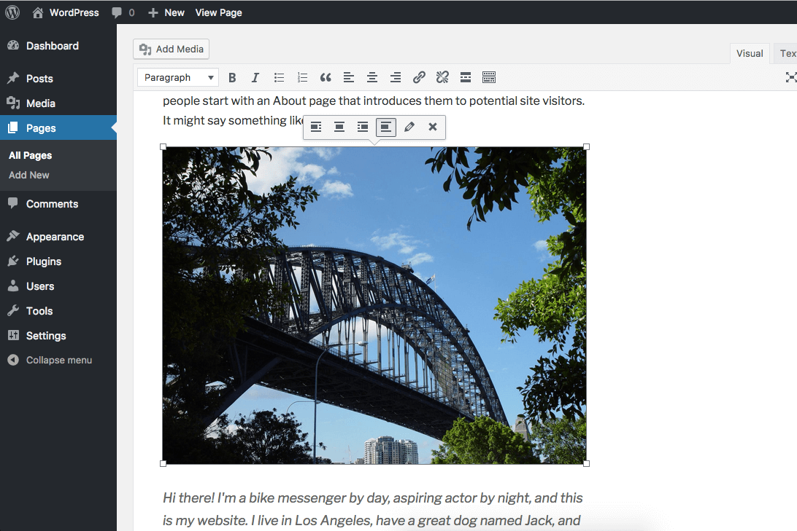
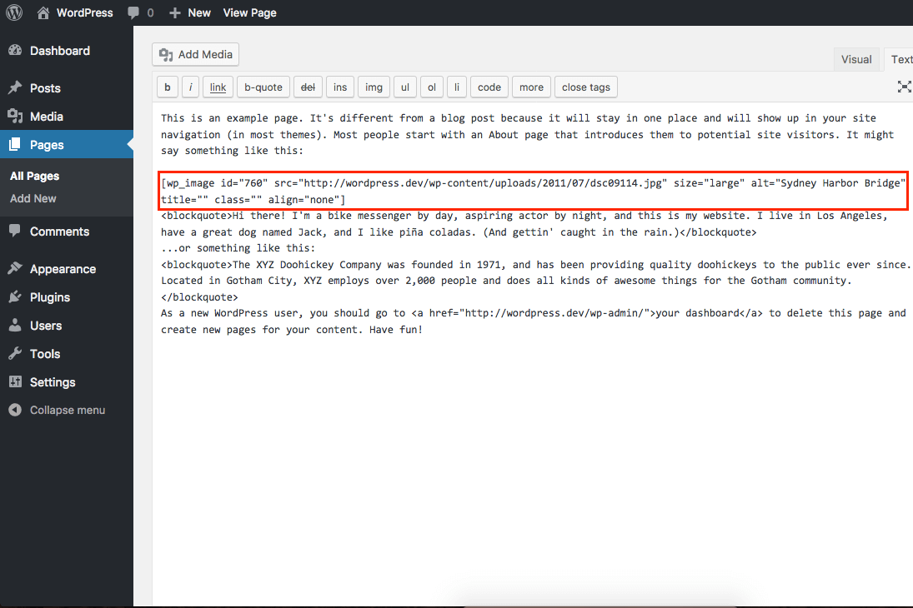

# WP Image

## What's the motivation behind this plugin?

This plugin aims to make its way to the WordPress core by build a better way to add images in the WordPress editor.

Currently, when an image is added in the TinyMCE editor, an **HTML IMG** tag is added in. There are a few problems with this approach:

1. Manipulating images becomes really hard. This is apparent with the current implementation of responsive images, which uses regex to match images to their IDs
1. Plugins are limited in what they can do with images added directly in the editor

## What does this plugin do?

This plugin uses a **shortcode** to save the image in the TinyMCE editor, instead of HTML. The image is rendered like it normally is in the editor, so the user experience is exactly the same.

The difference is that the image is saved as a shortcode, so it gives much better control to theme and plugin developers!

## What's on the roadmap for this plugin?

Making the shortcode work perfectly would be the top priority at this point. Other functionality like dynamic images can be considered once this plugin has a solid foundation.

## Contributing

Please contribute!! The plugin in it's current form is more of a prototype. So contributers will be more than welcome to make it a solid plugin, so it can be considered by WordPress core!
